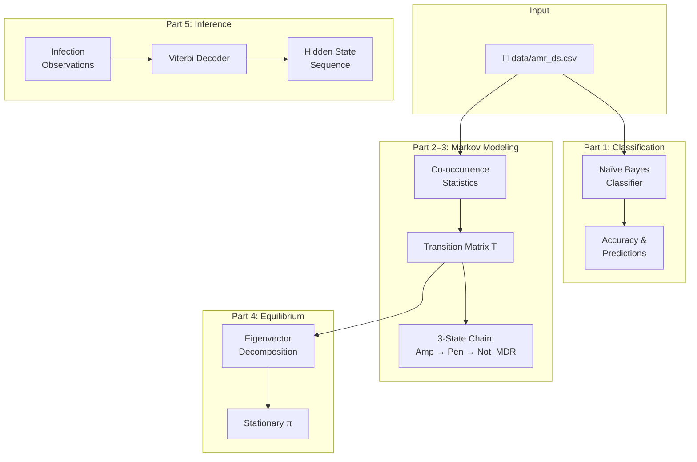
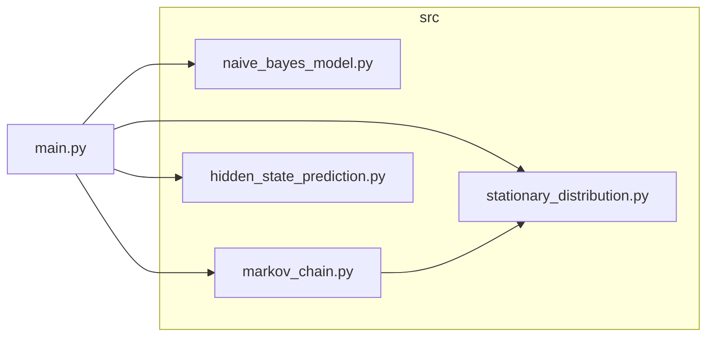

<div align="center">

# 🧬 Stochastic Resistance Intelligence

### *Production-Grade Probabilistic Modeling for Antimicrobial Resistance*

[](https://www.python.org/)
[](https://numpy.org/)
[](https://scikit-learn.org/)
[](https://pandas.pydata.org/)
[](https://opensource.org/licenses/MIT)

**Machine learning & probabilistic modeling for AMR surveillance and resistance prediction**

[Overview](#-overview) • [Architecture](#-architecture) • [Quick Start](#-quick-start) • [Methodology](#-methodology) • [Output](#-example-output)

</div>

---

## 📋 Overview

This project delivers an **end-to-end probabilistic analytics pipeline** for antimicrobial resistance (AMR) data. It combines supervised machine learning with stochastic modeling to classify resistance status, model state transitions, and infer hidden resistance states from observational data.

### 🎯 Core Capabilities

| Module | Technique | Output |
|--------|-----------|--------|
| **Classification** | Gaussian Naïve Bayes | Not_MDR prediction |
| **Co-occurrence** | NumPy logical ops | amp_pen, amp_nmdr, pen_nmdr |
| **State Dynamics** | Markov chain | 3×3 transition matrix T |
| **Equilibrium** | Eigenvector decomposition | Stationary distribution π |
| **Sequence Decoding** | Viterbi algorithm | Hidden state path |

### 📊 Dataset Schema

| Column | Type | Description |
|--------|------|-------------|
| `Ampicillin` | binary | β-lactam resistance |
| `Penicillin` | binary | β-lactam resistance |
| `Not_MDR` | binary | Non–multi-drug resistant (target) |

> **Path:** `data/amr_ds.csv`

---

## 🏗 Architecture

### Pipeline Flow



### Component Diagram



---

## ⚡ Quick Start

```bash
# Clone
git clone https://github.com/Amankhan2370/Stochastic-Resistance-Intelligence.git
cd Stochastic-Resistance-Intelligence

# Install
pip install -r requirements.txt

# Run full pipeline
python main.py
```

<details>
<summary><strong>📦 Virtual environment (recommended)</strong></summary>

```bash
python -m venv venv
source venv/bin/activate  # macOS/Linux
# venv\Scripts\activate   # Windows
pip install -r requirements.txt
python main.py
```

</details>

---

## 📐 Methodology

### 1. Naïve Bayes Classification

Gaussian Naïve Bayes predicts `Not_MDR` from `Ampicillin` and `Penicillin` with a 75/25 train–test split (fixed seed for reproducibility).

### 2. Co-occurrence Statistics

| Statistic | Definition | NumPy Expression |
|-----------|------------|------------------|
| `amp_pen` | Amp=1 ∧ Pen=1 | `np.sum((amp==1) & (pen==1))` |
| `amp_nmdr` | Amp=1 ∧ Not_MDR=1 | `np.sum((amp==1) & (nmdr==1))` |
| `pen_nmdr` | Pen=1 ∧ Not_MDR=1 | `np.sum((pen==1) & (nmdr==1))` |

### 3. Markov Transition Matrix

States: **Ampicillin (0)** | **Penicillin (1)** | **Not_MDR (2)**

$$T = \begin{bmatrix} 0 & \frac{amp\_pen}{amp\_nmdr+amp\_pen} & \frac{amp\_nmdr}{amp\_nmdr+amp\_pen} \\ \frac{amp\_pen}{pen\_nmdr+amp\_pen} & 0 & \frac{pen\_nmdr}{pen\_nmdr+amp\_pen} \\ \frac{amp\_nmdr}{amp\_nmdr+pen\_nmdr} & \frac{pen\_nmdr}{amp\_nmdr+pen\_nmdr} & 0 \end{bmatrix}$$

### 4. Stationary Distribution

Solve **πT = π** via eigenvector decomposition of \(T^\top\). The eigenvector for eigenvalue 1, normalized to sum to 1, yields the long-run state probabilities.

### 5. Hidden State Inference

Given observations `[Infection, No Infection, Infection]` and emission probabilities:

| State | No Infection | Infection |
|:-----:|:------------:|:---------:|
| Amp   | 0.4          | 0.6       |
| Pen   | 0.3          | 0.7       |
| NMDR  | 0.8          | 0.2       |

A simplified **Viterbi algorithm** returns the most probable hidden resistance sequence.

---

## 📂 Project Structure

```
Stochastic-Resistance-Intelligence/
├── 📁 data/
│   └── amr_ds.csv                 # Binary AMR dataset
├── 📁 src/
│   ├── naive_bayes_model.py       # Part 1: Classification
│   ├── markov_chain.py            # Part 2–3: Co-occurrence & T matrix
│   ├── stationary_distribution.py # Part 4: Eigenvector π
│   └── hidden_state_prediction.py # Part 5: Viterbi decoding
├── 📄 main.py                     # Orchestrator
├── 📄 requirements.txt
└── 📁 results/
```

---

## 📈 Example Output

<details>
<summary><strong>Click to expand full pipeline output</strong></summary>

```
############################################################
# Antimicrobial Resistance - Probabilistic Modeling
############################################################

============================================================
PART 1: Naïve Bayes Classification
============================================================
Training size: 272
Testing size:  91
Accuracy:      0.9451

============================================================
PART 2 & 3: Antimicrobial Co-occurrence & Markov Chain
============================================================

Co-occurrence counts (numpy logical operations):
  amp_pen:  107  (Ampicillin=1 AND Penicillin=1)
  amp_nmdr: 6    (Ampicillin=1 AND Not_MDR=1)
  pen_nmdr: 55   (Penicillin=1 AND Not_MDR=1)

Transition matrix T (states: Ampicillin, Penicillin, Not_MDR):
[[0.         0.9469  0.0531]
 [0.6605    0.      0.3395]
 [0.0984    0.9016  0.    ]]

============================================================
PART 4: Stationary Distribution
============================================================

Stationary distribution (πT = π):
  π(Ampicillin): 0.3363
  π(Penicillin): 0.4821
  π(Not_MDR):    0.1815

============================================================
PART 5: Hidden State Inference
============================================================

Observed: [Infection, No Infection, Infection]
Most probable resistance state sequence: ['Pen', 'NMDR', 'Pen']
```

</details>

---

## 🛠 Tech Stack

| Package | Version | Purpose |
|---------|---------|---------|
| **NumPy** | ≥1.20 | Linear algebra, array operations, eigen decomposition |
| **pandas** | ≥1.3 | Data loading, preprocessing |
| **scikit-learn** | ≥1.0 | GaussianNB, train_test_split, accuracy_score |

---

## 📜 License

MIT License — see [LICENSE](LICENSE) for details.

---

<div align="center">

**Stochastic Resistance Intelligence** — *Probabilistic modeling for antimicrobial surveillance*

[](https://github.com/Amankhan2370)

</div>
